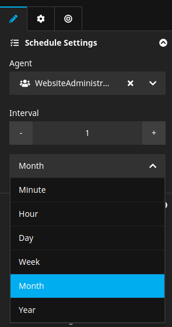
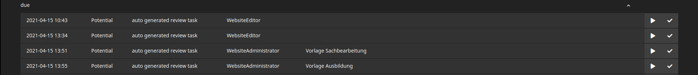

    <a href="./00_Index.md">Index</a>
    &nbsp;&nbsp;&nbsp;|&nbsp;&nbsp;&nbsp;
    <a href="./02_BuildingBlocks.md">2. Building Blocks &gt;</a>

---

# 1. The User Interface

Bitzer comes with several user interface components:
1. Mixin node types to assign agents or intervals for automatic task creation
2. The task reminder overlay on login into the backend
3. The task overview module for editors to keep track of their work
4. The task management module for administrators to manage task lifecycles

> Hint: Additionally, there is a command controller available for task handling.
> See ./flow help | grep bitzer

## Scheduling tasks

> Hint: For concrete examples, please see https://github.com/sitegeist/bitzer-review

The default way of scheduling tasks is to configure a node type to use one of Bitzer's mixins.
This way, individual nodes can be assigned to agents to perform tasks like review or translation
in a certain interval.

Which tasks are to be scheduled is up to the concrete task implementations that Bitzer itself is the framework for.

## The Task Reminder

Upon login to the Neos backend, if there are scheduled tasks for the current user (as actor),
an overlay is displayed that shows the open tasks and links to the task management module.

The most important function of PresentationObjects is to enforce the interface between domain and presentation layer.

For a single component that interface is represented by an actual PHP interface. So let's start with that:

## The Task Management Module

All tasks to be performed are listed in the task management module.
Here they can either be started or marked as complete. What happens when starting a task
is up to the concrete task's implementation. A review task might just open the node for review
while a translate task might create a variant of the node and display it.

---

    <a href="./00_Index.md">Index</a>
    &nbsp;&nbsp;&nbsp;|&nbsp;&nbsp;&nbsp;
    <a href="./02_BuildingBlocks.md">2. Building Blocks &gt;</a>

