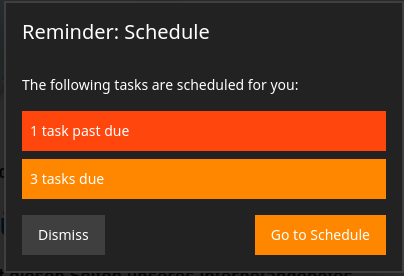

# Sitegeist.Bitzer

> A content lifecycle task manager for Neos CMS

## Installation

```
composer require sitegeist/bitzer
```

## Documentation

During its lifecycle, the content in your Neos installation will pass through various states of maturity.
From initial creation to approval by chief editors, translation into other languages, review for up-to-dateness and finally deletion,
there are a lot of **tasks** to be performed on certain **objects** by different **agents**.
Objects will usually be nodes in the Neos content repository, the agents the editors in your system.
Everything is modeled strictly using the corresponding [schema.org](https://schema.org/) types.
For more on this, please check the [Building Blocks section](./Documentation/01_BuildingBlocks.md).

Bitzer's goal is to provide a framework for handling these tasks as well as an infrastructure to easily implement custom tasks and their state management.




